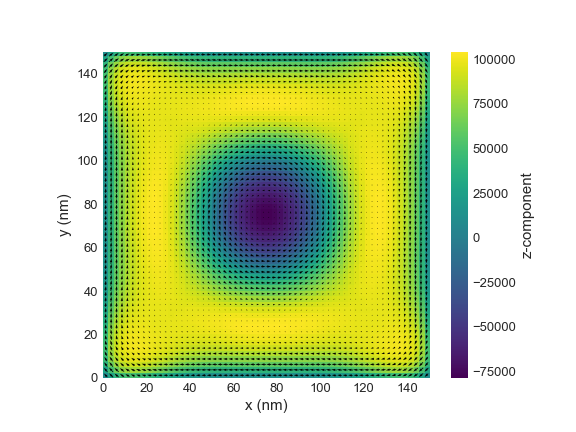
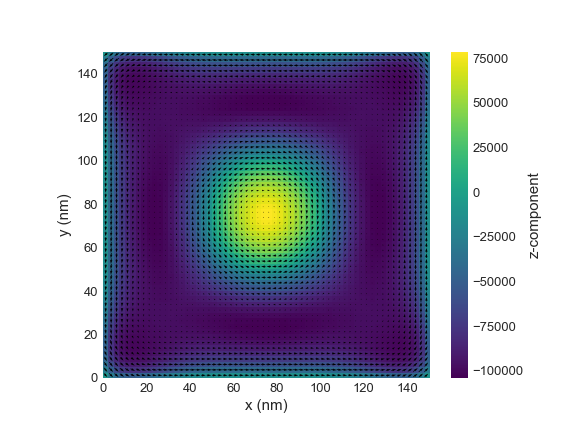

# IRP - Sijia Chen

## Isolated skyrmion state stability exploration using mean-field models

This repository contains scripts to develop mean-field model to search the isolated skyrmion state, focuses on the dependence of skyrmions on beta and external magnetic field strength.

The project can be intalled using 
```bash
git clone https://github.com/ese-msc-2021/irp-sc121.git
```

If you have any questions, please do not hesitate to get in touch with Sijia (sijia.chen121@imperial.ac.uk).

## Detailed Implement

- The detailed implement methods can be found in [src/](./src) directory.
- The detailed information and results can be found in [reports/sc121-final-report](./reports/sc121-final-report).
- A simulation with parameters of thin-film magnetic FeGe nanostructure can be found in [src/simulation.py](./src/simulation.py).

The example outputs for isolated skyrmion state implemented by the scripts:

**beta = 5000, B = 0.8 T** :



**beta = 5000, B = -0.8 T** :



Clear images can be found in [images/](./images)

## Environment and Dependencies
The project is developed to object-oriented programming (OOP) in Python. An open source Ubermag package has been used to initialize the system and test the results. The environment and dependencies are listed as follows,
- Operating System: macOS Monterey 12.4
- Compiler: Python 3.8
- Dependencies: 
  - NumPy
  - discretisedfield
  - micromagneticmodel
  - oommfc
  - Matplotlib
  - pytest

You can install environment
```bash
conda create -n ubermag_env python=3.8
conda activate ubermag
```
and install dependencies using
```bash
conda install --channel conda-forge ubermag
pip install -r requirements.txt
```

## Simulation
You can do the simulations by running or modifying [src/simulation.py](./src/simulation.py) using
```bash
python src/simulation.py
```

The size of the magnetization vector field and lattices can be changed by modifying when define 'region' and 'mesh'. The material parameters can also be changed with 'D', 'A' and 'Ms'.

To discover the dependence of magnetic stability, the external magnetic field should be changes, which is defined as 'B' in the files.

To dicover the dependence of thermal stability, the beta is defind as temperature parameter. Zero temperature corresponds beta = 9e99, if you want to raising the temperature, set beta to a smaller value, for example, beta = 5e3.

The skyrmion number S can be calculated using
```bash
import discretisedfield.tools as dft
dft.topological_charge(m.plane("z"), method="continuous", absolute=False)
```
and its scalar value
```bash
import discretisedfield.tools as dft
dft.topological_charge(m.plane("z"), method="continuous", absolute=True)
```
